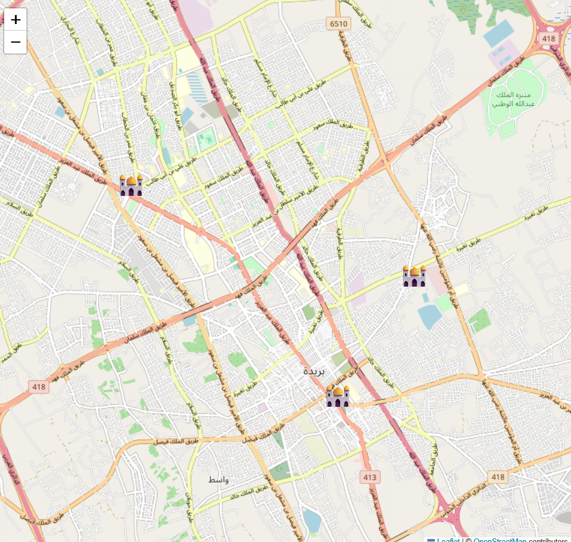

# 🕌 Mosques Management System

A Python desktop application for managing mosque data using a database and interactive map visualization.

---

## 📌 Overview

This project allows users to:

* Store mosque information in a database
* Manage records (add, delete, update)
* Search for mosques
* Visualize locations on an interactive map

---

## 🛠️ Technologies Used

* Python 🐍
* Tkinter (GUI)
* SQLite (Database)
* Folium (Map Visualization)

---

## 🚀 How to Run

1. Open **Anaconda Prompt**
2. Navigate to the project folder:

   ```bash
   cd Desktop\mosques_upgraded_project
   ```
3. Run the application:

   ```bash
   python mosques_app.py
   ```

---

## 🌍 Map Preview



Interactive map showing mosque locations in Buraydah 🕌

---

## 📂 Project Files

* `mosques_app.py` → Main application
* `mosques.db` → Database
* `mosques_all_map.html` → Generated map
* `requirements.txt` → Required libraries

---

## ✨ Features

* Add and manage mosque records
* Smart search functionality
* Export data to CSV
* Interactive map with mosque icons 🕌

---

## 👩‍💻 Author

Waad Al-Duraibi
